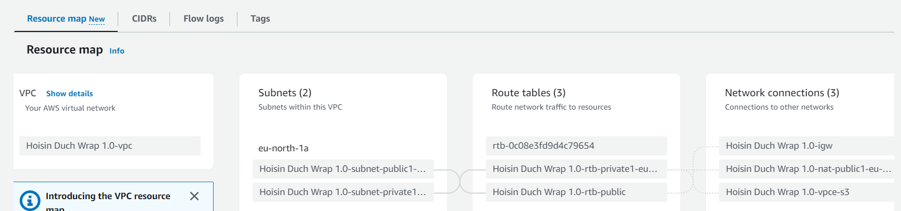
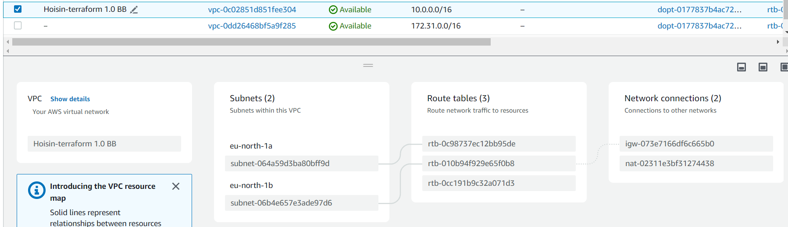

# terraformEC2-2subnets

# Introduction
This project  creates a VPC in the eu-north-1 region of AWS with two subnets (one public and one private), an Internet Gateway, a NAT Gateway, and two EC2 instances (one in each subnet). It also creates a security group that allows incoming traffic on port 22 (SSH) to both EC2 instances and generates an Ansible inventory file dynamically using a local_file resource.
<br>


```
Terraform Ec2 - with 2 subnet/
├── ansible/
│   ├── inventory.ini
│   └── playbook.yml
└── terraform/
    ├── main.tf
    └── inventory.tpl
```


First attemp:

# Created in the browser from  aws page
 

<br>

# Created using terraform first attempt ("output from terraform")
<br>
 
